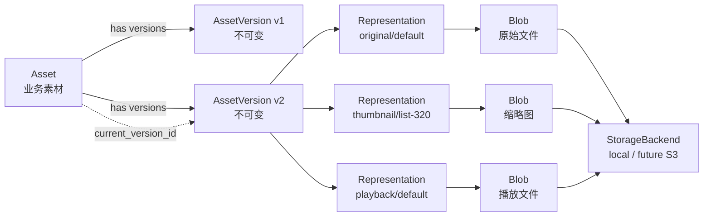
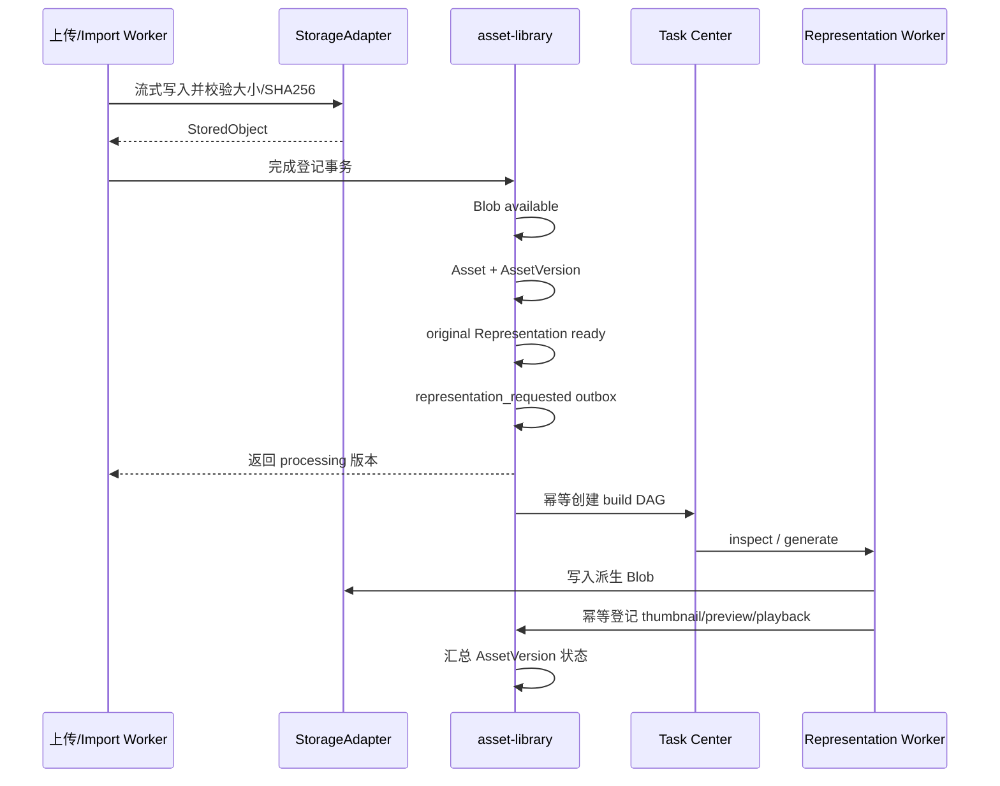

# Asset、Representation 与 Blob 机制

## 1. 机制概览

OmniMAM 将“素材是什么”“素材的哪个版本”“这个版本如何展示”和“文件实际存在哪里”拆成四层：

| 对象 | 回答的问题 | 主要职责 |
| --- | --- | --- |
| `Asset` | 这是什么素材？ | 业务身份、名称、类型、描述、标签、Collection、当前版本和生命周期 |
| `AssetVersion` | 这是素材的哪个内容版本？ | 保存不可变内容版本、来源、处理状态和 Representation 策略版本 |
| `AssetRepresentation` | 这个版本以什么技术形式使用？ | 表达原始文件、缩略图、预览、播放格式或技术包，并关联具体 Blob 或结构化内容 |
| `Blob` | 二进制内容实际是什么、放在哪里？ | 保存 StorageBackend、object key、大小、MIME、SHA256 和可用状态 |
| `StorageBackend` | Blob 由哪个存储系统承载？ | 配置 local、S3、MinIO 等物理存储实现，由 StorageAdapter 访问 |

最短定义：

```text
Asset               = 业务身份
AssetVersion        = 不可变内容版本
AssetRepresentation = 同一版本的技术表现
Blob                = 物理二进制对象记录
StorageBackend      = 物理存储位置与实现
```

`AssetVersion` 是连接业务与物理内容的关键中间层。Asset 不直接引用文件，Representation 不直接属于 Asset，Blob 也不知道自己是什么业务素材。

## 2. 对象关系



关系约束：

- 一个 Asset 可以有多个 AssetVersion。
- `Asset.current_version_id` 指向默认使用的版本，不删除历史版本。
- 一个 AssetVersion 可以有多个 Representation。
- Representation 的稳定身份由 `asset_version_id + representation_type + profile + profile_version` 决定。
- 一个 Representation 最多引用一个 Blob；canonical 或 manifest 等结构化内容也可以直接保存在内容/metadata 中，不一定需要 Blob。
- 一个 Blob 可以被多个 Representation 或 Artifact 引用，所以删除一个 Asset 不代表 Blob 一定可以物理删除。
- 一个 StorageBackend 可以保存多个 Blob。

## 3. Asset：业务素材身份

Asset 是用户搜索、分类、引用和管理的对象，例如“女主角正面参考图”或“第一幕成片”。它主要承载：

- owner、名称、描述、媒体类型和业务状态。
- Labels、Tags、Collection 和素材关系。
- `current_version_id`，用于 `latest` 引用策略。
- 列表投影信息，例如格式、大小、宽高、时长、SHA256、缩略图和预览状态。
- 软删除、归档及轻量引用摘要。

Asset 不是文件，也不是目录：

- 改名、改描述和改标签不会修改 Blob。
- Collection 组织多个 Asset，但不对应物理目录。
- 一个 Asset 不应用来装视频、字幕、音轨和剧本这一组内容；这些应分别成为 Asset，再通过关系关联。

Asset 状态为：

```text
active | archived | deleted
```

## 4. AssetVersion：不可变内容版本

AssetVersion 表示同一个 Asset 的一次确定内容。上传替换文件、编辑 canonical 内容或明确导入为新版本时，都创建新的 AssetVersion，不能覆盖旧版本。

它负责保存：

- `asset_id + version_no` 的版本身份。
- `source_type` 与 `source_ref_id`，说明来源是上传、Artifact、编辑、转换或外部导入。
- canonical 内容与版本级 metadata。
- Representation policy 的 `profile_version`。
- expected、completed、failed 数量和整体处理状态。

版本状态为：

```text
uploading -> processing -> ready
                         -> ready_with_warnings
                         -> failed
```

状态含义：

- `ready`：所有必需 Representation 已完成，没有阻止正常使用的缺口。
- `ready_with_warnings`：必需内容可用，但一个或多个可选 Representation 失败。
- `failed`：必需 Representation 失败，版本不能按预期使用。
- 原始文件安全登记成功与所有派生内容 ready 是两个时刻，上传接口不应等待视频转码或文档预览完成。

正式运行若使用 `latest`，运行开始时必须解析并记录具体 `resolved_asset_version_id`；运行记录不能只保存 Asset ID，否则以后切换当前版本会破坏可复现性。

## 5. AssetRepresentation：同一内容的技术表现

Representation 不创造新的业务素材，它描述同一 AssetVersion 如何被保存、展示、预览或播放。

### 5.1 类型

| 类型 | 用途 | 常见内容 |
| --- | --- | --- |
| `original` | 原始上传或生成文件 | TIFF、MOV、WAV、DOCX、ZIP 等 |
| `canonical` | 系统内部标准结构 | text、prompt、prompt_template 的 JSON 内容 |
| `thumbnail` | 列表和选择器的小图 | JPEG、WebP、PNG |
| `preview` | 浏览器可查看的预览 | TIFF 转 WebP、DOCX 转 PDF/图片 |
| `playback` | 浏览器可播放媒体 | MOV 转 H.264 MP4、音频兼容格式 |
| `package` | 多文件技术包 | 3D 模型 ZIP/TAR |
| `manifest` | 技术包内容清单 | metadata 或 JSON Blob |

Representation 以 `profile` 区分同一类型的具体用途，例如 `thumbnail/list-320`；`profile_version` 固定生成策略版本，保证新旧处理规则可以区分并幂等重建。

### 5.2 哪些是 Representation

判断标准是：内容是否只是同一个版本的技术呈现，还是具有独立业务价值。

属于 Representation：

- 图片缩略图和浏览器兼容预览图。
- 视频的浏览器兼容播放文件和缩略图。
- 文档预览 PDF、首页图。
- 3D 素材技术包及其 manifest。

应创建独立 Asset：

- 视频字幕、独立音轨和剧本。
- 图片遮罩、深度图、法线图和姿态图。
- 去背景结果、风格化结果、放大后的最终图片。
- 可以独立搜索、编辑、标记或作为画布输入的任何内容。

### 5.3 状态与必需性

Representation 状态为：

```text
pending -> processing -> ready
                      -> failed -> processing
                      -> irreparable
ready/failed/irreparable -> deleted
```

`required` 表示该 Representation 是否决定 AssetVersion 可用性：

- 必需项失败，AssetVersion 为 `failed`。
- 可选项失败，AssetVersion 可为 `ready_with_warnings`。
- 缺口修复后，版本状态可以提升到 `ready`。

素材 UI 必须以 AssetVersion 和 Representation 事实判断可用性，不能因为某个 AtomicTask 显示成功就自行推断缩略图或播放文件存在。

## 6. Blob：物理内容事实

Blob 是存储对象的数据库记录，包含：

- `storage_backend_id`：使用哪个 StorageBackend。
- `object_key`：存储后端内部对象键或相对路径。
- `sha256`：内容摘要。
- `size_bytes` 和 `mime_type`。
- `pending / available / corrupted / missing / deleting / deleted` 状态。

Blob 不保存以下业务语义：

- 素材显示名称、标签或 Collection。
- 文件是 original、thumbnail 还是 playback。
- 当前版本、素材来源或画布引用关系。

这些语义分别由 Asset、AssetVersion、Representation 和引用关系维护。

业务代码不能把服务器绝对路径当成 Blob 身份。数据库只保存类似：

```text
storage_backend_id = local-main
object_key = blobs/8f/8f74ab...
```

StorageAdapter 再把 object key 映射到本地根目录或未来的对象存储。这样从 local 切换到 S3/MinIO 时，上层对象模型不变。

SHA256 索引用于内容识别与去重判断，但当前 Blob schema 并没有把 SHA256 定义为全局唯一键。业务层的上传去重首先受 owner 可见范围约束，不能仅凭摘要跨用户泄露或返回其他用户素材。

### 6.1 多 StorageBackend 语义

`storage_backends` 是一组后端配置，不是单例。数据模型允许同时存在多条记录，例如：

```text
local-hot    -> /data/ssd/assets
local-cold   -> /data/hdd/assets
local-archive -> /mnt/archive/assets
s3-main      -> s3://omnimam-assets
```

但需要区分以下能力：

| 能力 | 数据模型 | 当前实现 |
| --- | --- | --- |
| 注册多个 StorageBackend | 支持 | 支持多条配置记录 |
| 不同 Blob 分布在不同后端 | 支持；每个 Blob 保存一个 `storage_backend_id` | 读取可按 Blob 的 backend ID 找到对应 local 根目录 |
| 新写入在多个本地目录间选择 | 模型可扩展 | 未实现分配策略；固定选择最早创建的 enabled、writable local backend |
| 同一个 Blob 在多个后端保存副本 | 不支持；Blob 只有一个 `storage_backend_id` | 未实现 |
| local 与 S3/MinIO 混合读写 | 类型预留 | 未实现 S3/MinIO ContentStorage adapter 和按类型路由 |
| 跨后端迁移、故障切换和自动分层 | 第一阶段非目标 | 未实现 |

因此，“多 StorageBackend”当前表示多个可登记的物理存储池，不表示一个 Blob 天然拥有多个副本。

不同图片分别放在不同本地目录，可以用不同 local StorageBackend 表达；但当前上传和派生写入不会自动按容量、媒体类型或优先级选择目录，而是写入最早创建的可写 local backend。已有 Blob 的读取和删除仍使用它自己的 `storage_backend_id`，不能改用当前默认后端。

同一图片同时保存在两个本地目录，不能通过创建两个无关联 Blob 冒充副本。这样做缺少主副本、健康状态、同步进度、故障切换和一致删除语义。未来若需要多副本，应在 SSOT 中增加独立的 Blob location/replica 模型，使一个逻辑 Blob 对应多个物理位置，而不是改变 AssetRepresentation 的业务身份。

S3/MinIO 环境需要 StorageAdapter registry 按 Blob 的 backend type 分发 `Put/Open/Stat/Delete/CreateAccessURL`。写入端还需要明确选择策略，例如默认后端、容量低水位、媒体类型、冷热层级或管理员指定目标；这些策略当前均未 release，也未实现。

对于服务器批量导入，导入源目录与 StorageBackend 是两个概念：Import Source 是只读来源，StorageBackend 是系统接管后的受管目标。多个来源目录可以导入同一个 StorageBackend，不应仅因为文件原来位于多个目录，就把这些目录都登记为长期受管后端。

## 7. 创建与处理链路

### 7.1 文件上传或服务器批量导入



Asset、AssetVersion、original Representation 和 Representation 请求 outbox 必须在同一业务事务中完成。事务回滚时不得发布构建请求。

派生处理的职责边界：

- asset-library 决定某媒体类型和 profile version 需要哪些 Representation。
- Task Center 只负责任务编排、重试和运行历史，不发明媒体策略。
- Worker 读取受控 original 内容、生成派生 Blob，再通过受控写能力登记 Representation。
- Worker/Task Center 只传递 AssetVersion、Representation 和 Blob 的小型引用，不在任务状态中保存大文件或永久 URL。

### 7.2 Artifact 登记

Artifact 是任务或应用产生、尚未成为正式素材的制品。将 ready Artifact 登记为 Asset 时：

1. 创建或命中 Asset 和 AssetVersion。
2. 复用 Artifact 已有 Blob 创建 `original` Representation，不重复复制二进制内容。
3. 更新 Artifact 登记结果。
4. 同事务写 Representation 请求 outbox。

Artifact 与 Asset 仍是不同业务对象；复用 Blob 只是复用同一物理内容。

### 7.3 canonical 素材

text、prompt 和 prompt_template 可将结构化 canonical 内容直接保存在 AssetVersion/Representation 内容字段中，不一定创建 Blob。此时仍然保留 Asset 和 AssetVersion 语义，只是内容不是外部二进制对象。

## 8. 读取与访问

内容访问从 Representation 开始，而不是从 object key 或绝对路径开始：

```text
representation_id
  -> AssetRepresentation
  -> AssetVersion
  -> Asset
  -> 校验当前用户 owner/权限
  -> Blob
  -> StorageAdapter.Open(object_key)
```

对外提供两种受控方式：

- 通过服务端内容端点读取或下载。
- 获取短期有效的受控访问地址。

画布、应用和前端不得持久化本地路径、object key 或永久下载 URL。业务引用保存 Asset/AssetVersion/Representation ID；临时访问地址过期后重新获取。

列表不得读取重型 original 内容。图片、视频、音频和文档列表使用 thumbnail、placeholder 或 derived preview；需要下载或原始检查时再进入受控内容读取链路。

## 9. 去重、共享与幂等

三者不是同一个概念：

- 上传去重：当前 owner 的 Asset SHA256 命中时，可以跳过再次上传并返回已有 Asset。
- Blob 共享：多个 Representation 或 Artifact 可以引用同一个 Blob，例如原始视频已兼容浏览器时，`original` 与 `playback` 可引用同一 Blob。
- Representation 幂等：同一 `version + type + profile + profile_version` 重复登记必须返回同一结果；相同键却提交不同 Blob 时应视为冲突。

首次 Representation build 使用稳定幂等键：

```text
asset-representations:<asset_version_id>:<profile_version>
```

单项生成使用稳定的 representation type/profile 身份。自动重试不得创建重复 Representation 或重复 AssetVersion。

## 10. 删除与回收

### 10.1 软删除

普通删除只把 Asset 标记为 `deleted` 并写 `deleted_at`：

- AssetVersion 保留。
- Representation 保留。
- Blob 保留。
- 来源和引用信息保留。
- Asset 可按权限恢复。

因此“从素材列表删除”不等于“立即释放磁盘空间”。

### 10.2 永久删除

永久删除前必须检查画布、应用、Task Center、Collection 和素材关系等强引用。轻量 `reference_count` 只用于提示，不能替代事实源检查。

删除 Asset/Version/Representation 关系后，对每个 Blob 再执行引用计数式检查：

```text
仍被其他 Representation 或 Artifact 引用 -> 保留 Blob
不再被任何对象引用                    -> 删除存储对象并删除/终结 Blob
```

物理删除应先形成明确的待删除对象集合，再通过 StorageAdapter 删除。某些 Blob 被共享时，永久删除结果需要区分 `deleted_blob_ids` 和 `retained_blob_ids`。

## 11. 典型示例

### 11.1 图片

```text
Asset: 城市夜景原画
└── AssetVersion v1
    ├── original/default -> Blob A (city-night.tiff)
    ├── preview/default  -> Blob B (city-night.webp)
    └── thumbnail/list-320 -> Blob C (320px PNG/WebP)
```

修改画面内容时创建 v2；重新生成 v1 的缩略图仍属于 v1 的 Representation，不创建 AssetVersion v2。

### 11.2 视频

```text
Asset: 第一幕成片
└── AssetVersion v1
    ├── original/default -> Blob A (ProRes MOV)
    ├── playback/default -> Blob B (H.264 MP4)
    └── thumbnail/list-320 -> Blob C

Asset: 第一幕字幕
└── AssetVersion v1
    └── original/default -> Blob D (SRT)
```

字幕有独立业务价值，所以是另一个 Asset，并通过 `subtitle_of` 关系关联视频，而不是视频的 Representation。

### 11.3 Prompt

```text
Asset: 夜景人物生成提示词
└── AssetVersion v1
    └── canonical/default -> JSON content，无 Blob
```

## 12. 实现与设计检查清单

- 是否把业务身份放在 Asset，而不是文件路径或 Blob？
- 内容变化是否创建新 AssetVersion，而不是覆盖 original？
- 技术转码是否创建 Representation，而不是新 AssetVersion？
- 独立业务内容是否创建新 Asset，而不是滥用 Representation？
- 文件型版本是否有 ready 的 original Representation？
- Representation 是否固定 profile 与 profile version 并可幂等登记？
- Blob 是否只保存物理内容事实，object key 是否对外隐藏？
- 内容读取是否沿 Representation -> Version -> Asset 校验 owner？
- UI 是否依据版本/Representation 状态，而不是 Task 成功状态？
- 删除 Blob 前是否同时检查 Representation 和 Artifact 引用？
- 存储访问是否全部经过 StorageAdapter？
- 批量导入是否复用相同的登记事务和 Representation outbox？

## 13. 当前实现边界

当前已验证的图片与视频策略是：

```text
original/default + thumbnail/list-320
```

上传或 Artifact 登记事务登记 original 并发布完整 Representation 计划，TaskWorker 创建 `inspect -> thumbnail:list-320 -> finalize` DAG，生成 PNG Blob 并登记 thumbnail Representation。图片使用 Go generator；视频 generator 依赖可替换 `FFmpegRuntime`，当前 adapter 通过本地 FFmpeg CLI 选择代表帧，限制最长边 320、单次 30 秒和两路并发。业务 executor 不接触命令参数、临时路径或 stderr。

`asset-library.representation-backfill` 已按 released S2 注册为唯一 SYSTEM RECONCILE 计划，每日 `03:30 UTC` 使用稳定 AssetVersion ID checkpoint 补齐缺失、可重试或可重建的 expected Representation。preview、playback、package 和 manifest 的完整 policy/adapter 仍属于后续实现工作。

本机制说明描述已 release 的领域模型和当前已验证链路，不新增 API、表、权限码、错误码或事件。
