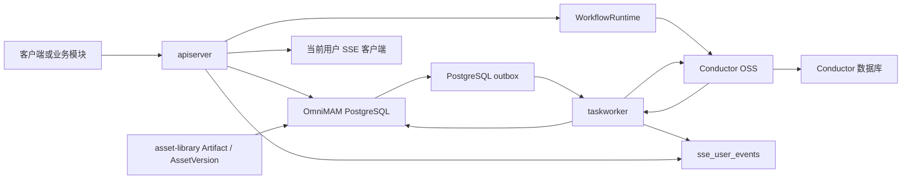
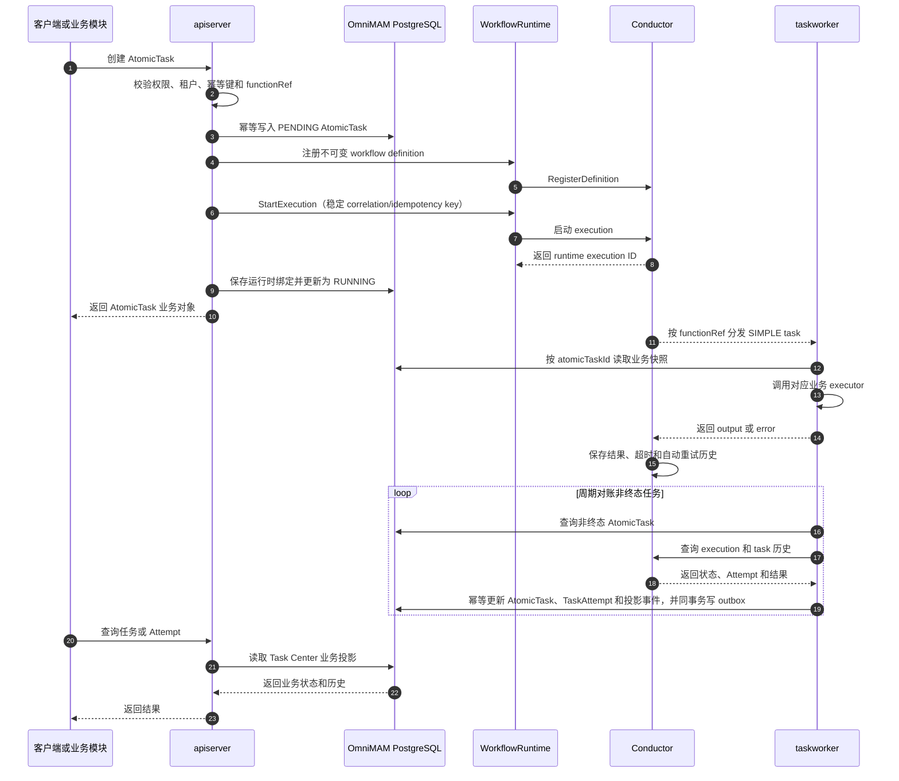
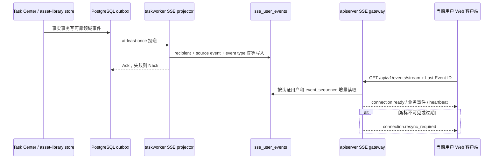
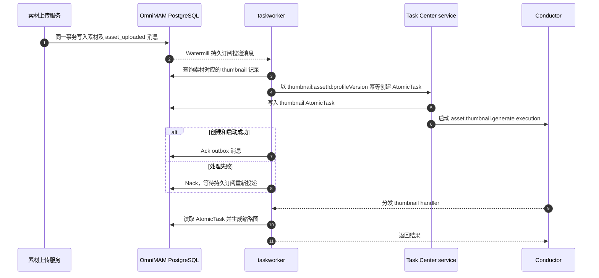
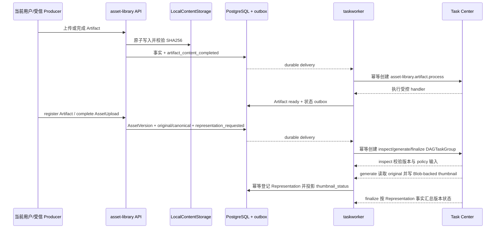

# TaskWorker 与 API Server 协作流程

本文说明 OmniMAM 中 `apiserver`、`taskworker`、Conductor、SSE gateway 和 PostgreSQL 的职责边界，以及 AtomicTask 从创建到状态投影、DAG 可观测查询、执行日志和用户事件推送的完整流程。本文对齐已发布的 `spec-v1.7.2`，不使用已废弃的 TaskRun、ExecutionLease 或自研 Dispatcher 协议。

## 1. 架构定位

Task Center 是对外业务入口和业务状态投影事实源，Conductor 是内部执行与编排运行时。`apiserver` 和 `taskworker` 不直接通过进程内调用协作，而是分别连接 OmniMAM 业务 PostgreSQL 和 Conductor：



该边界保证 API Server 保持无状态。扩容或重启 API Server 不会隐式创建新的进程内任务执行器；任务执行、自动重试、超时和运行历史由 Conductor 持久化管理。

## 2. 组件职责

| 组件 | 主要职责 | 不负责 |
| --- | --- | --- |
| `apiserver` | 提供 Task Center 和当前用户 SSE API；执行权限、租户、参数和 `functionRef` 校验；持久化 Task Center 事实；按认证用户读取短期 UserEvent 并流式发送 | 不注册 Worker handler，不从 Conductor 直接推送 SSE，不维护 Worker lease |
| `taskworker` | 注册受控 Worker handler；运行 reconciler；消费素材 outbox、Task Center 与 asset-library 可靠事件；幂等投影 `sse_user_events` | 不提供外部业务 API，不把 SSE 故障反向写入任务或素材事实，不实现自研 DAG 状态机 |
| Conductor | 负责任务调度、Worker 分发、并发控制、自动重试、超时、DAG 状态机和内部运行历史 | 不拥有 Task Center 业务资源，不直接写 OmniMAM 业务表 |
| OmniMAM PostgreSQL | 保存 Task Center 业务资源和状态投影、Application/Asset 等领域数据及 PostgreSQL outbox | 不保存 Conductor 的内部运行历史 |
| Conductor 数据库 | 保存 Conductor workflow、task、schedule 和重试历史 | 不作为前端或其他业务领域的查询入口 |

业务代码只依赖 `WorkflowRuntime` 接口。生产环境使用 `ConductorRuntime`，测试可以注入 fake；Controller、Service 和其他领域不得直接依赖 Conductor API 或数据库。

## 3. 启动协作

### 3.1 API Server 启动

`apiserver` 初始化业务数据库、Task Center service 和 `WorkflowRuntime`，然后启动 HTTP Server。它持有运行时控制能力，用于创建、查询、取消和管理任务，但不调用 `RegisterHandler`，也不启动任务执行 goroutine。

### 3.2 TaskWorker 启动

`taskworker` 使用与 API Server 一致的业务数据库配置，并连接同一个 Conductor。启动过程依次完成：

1. 初始化 OmniMAM store 和业务 schema。
2. 创建 `ConductorRuntime`。
3. 加载 application runtime registry 和 provider capability registry。
4. 构造 application、thumbnail、Engine 健康和 ComfyUI object-info executor。
5. 按受控 `functionRef` 向 Conductor 注册 AtomicTask handler 及并发度。
6. 订阅 `asset_uploaded`、`artifact_content_completed`、`asset_version_representation_requested`，以及 Task Center 和 asset-library Artifact/AssetVersion 变化 outbox。
7. 启动 SSE projector，按来源事件键幂等写入当前用户短期事件投影。
8. 幂等确保 Engine 健康检查与 ComfyUI object-info 刷新 SYSTEM RECONCILE Schedule。
9. 启动 reconciler，周期对账非终态 execution。

当前注册的 handler 包括：

- `application-platform.run`
- `asset.thumbnail.generate`
- `task_center_reconcile_controller`
- `task.schedule.acquire`
- `asset-library.artifact.process`
- `asset-library.representation.inspect`
- `asset-library.representation.generate`
- `asset-library.representation.finalize`

Engine 健康和 ComfyUI object-info 刷新不注册逐实例 Worker handler。两者分别以 `application-platform.engine-health` 和 `application-platform.comfyui-object-info-refresh` 注册到 `ReconcileRegistry`，由固定 `task_center_reconcile_controller` 直接扫描并更新业务事实。object-info 计划默认每日 `03:00 UTC` 运行，只处理 enabled、online 的 ComfyUI 实例；成功原子替换一对一当前目录，失败保留最后一次成功内容。

`taskworker` 收到 `SIGINT` 或 `SIGTERM` 后取消进程上下文，停止 outbox 消费和 reconciler，并关闭 Conductor Worker runner。

## 4. AtomicTask 主流程



流程中的关键边界如下：

- AtomicTask 是唯一由 Worker handler 执行的业务资源。TaskGroup、DAGTaskGroup 和 TaskSchedule 只负责编排或触发，不作为 Worker 业务执行单元。
- API Server 使用稳定的 correlation ID 和幂等键启动运行时，避免相同创建请求生成重复 execution。
- Worker 根据 Conductor 输入中的 `atomic_task_id` 从业务数据库加载完整业务快照，而不是信任用户传入任意 Worker 名、endpoint、脚本或凭证。
- Conductor 保存运行事实；Task Center 保存其他领域和前端可见的业务投影。外部调用方只通过 API Server 查询 Task Center。
- 自动重试由 Conductor 执行，并在同一个 AtomicTask 下投影新的 TaskAttempt；手动重试通过 API Server 创建新的 AtomicTask。
- Task Center 事务只写业务事实和可靠 outbox；SSE projector 在独立消费事务中写 UserEvent。投影失败会 Nack 重试，不回滚或阻塞任务事实。

### 4.1 Attempt 执行日志

Conductor 保存日志正文，Task Center 只保存稳定、不透明的 `logs_ref=task-attempt-log:<task_attempt_id>` 并提供授权读取入口：

```text
GET /api/v1/atomic-tasks/{atomic_task_id}/attempts/{task_attempt_id}/logs
```

API Server 先校验 AtomicTask 对当前主体可见，再以父任务 ID 和 Attempt ID 联合查询归属，最后通过 `WorkflowRuntime.ListTaskLogs` 代理读取。客户端使用 `page_num/page_size` 或不透明 cursor 轮询，默认每页 100 条、最大 200 条；支持 `keyword`、`levels`、`sources`、前后方向和升降序筛选。`GET .../logs/download` 复用同一授权、过滤、排序、脱敏和 retention 管线，只跳过在线分页。日志返回 `sequence/source/level/message/occurred_at`，不向客户端暴露 Conductor 地址、runtime credential 或原始日志对象。

TaskWorker 为每个 runtime task 绑定非空 `TaskLogger`。运行时统一写入 started、waiting、succeeded、failed 生命周期日志；reconciler 补充 canceled 和 timed_out；业务 executor 只记录固定阶段、状态变化和受控计数。日志不包含输入正文、URL、文件路径、Provider 原始响应或凭证。写入和读取边界均执行凭证/URL 脱敏、单行化、UTF-8 修复和 4096 字节限制。日志写入使用短超时且为 best-effort，失败只影响运维日志和指标，不改变 AtomicTask 或 TaskAttempt 结果。

日志可用期跟随 Conductor runtime task history。runtime task 存在但尚无日志时返回空列表；历史已被 retention 清理时返回 `ERR_TASK_ATTEMPT_LOG_UNAVAILABLE`；Conductor 暂时不可用时返回 `ERR_WORKFLOW_RUNTIME_UNAVAILABLE`。执行日志不进入 PostgreSQL 日志表、Asset Library、Conductor UI 或用户事件 SSE。

### 4.2 DAG 运行可观测读模型

`GET /api/v1/dag-task-groups/{id}` 返回触发快照、开始/完成时间和全部声明节点的执行聚合；`events` 与 `timeline` 子资源分别返回白名单事件和 `DEPENDENCY_WAIT/QUEUE_WAIT/RUNNING/RETRY_WAIT` 规范化区段。历史时间边界不完整时，timeline 使用 `complete=false`，不会推断或复制 Conductor 原始 payload。

每个 DAG AtomicTask 保存 `dag_node_key`。静态节点聚合唯一主任务；动态节点按共享 node key 聚合实际 child，并继续通过 `/tasks?node_key=...` 独立分页。Conductor Dynamic Fork planner 输出在 runtime adapter 边界获得确定性的 `atomic_task_id`、`dag_node_key`、`function_ref`、`child_key/order` 和 arguments envelope；reconciler 根据该 envelope 幂等物化实际 AtomicTask。调度、重试、Canvas 和领域事件在 DAG 创建时保存来源类型、时刻和可选 ID/名称快照，后续不回查改写历史。

TaskAttempt 只保存执行器类别和显示名快照。该摘要仅在现有管理员主体校验通过时返回，且不含 Worker ID、队列、主机或地址。事件和时间线从 `runtime_projection_events`、AtomicTask 与 TaskAttempt 投影生成，不新增第二张运行历史表。

## 5. 用户事件与 SSE 恢复流程



`event_sequence` 只表示用户事件流恢复顺序，不替代各业务聚合的 `resource_version`。API Server 不缓存未发送事件：每批最多读取 200 条，单次写有 5 秒 deadline；慢客户端断开后使用持久事件重放。默认保留 24 小时，配置项只影响 UserEvent，不改变 AtomicTask、TaskAttempt 或 Group/DAG 历史。实例退出时先发送 `connection.server_draining`，再关闭连接。

asset-library 由 `Artifact` 和 `AssetVersion` owner store 在事实事务内分别写入 `artifact_created`、`artifact_processing_changed`、`artifact_registration_changed` 和 `asset_version_processing_changed`。Projector 使用独立消费者组 `sse-asset-library-projector`，将 source 的 `progress/retryable/error_code` 归一化为公开 payload 的 `processing_progress`、`processing_retryable` 或 `registration_retryable`，并移除 owner、project、namespace 和 source routing 字段。正文、Provider 响应、内部错误详情和物理内容引用不进入 UserEvent。

## 6. 素材上传与缩略图 outbox 流程

素材上传和缩略图生成通过 PostgreSQL outbox 解耦，避免素材记录已提交但缩略图任务通知丢失。



消费者组固定为 `task-center-thumbnail`。AtomicTask 使用素材 ID 和 profile version 组成幂等键，因此消息重投不会重复创建同一版本的缩略图任务。

### 6.1 spec-v1.5.1 canonical asset-library

`apiserver` 在 `/api/v1` 安装 asset-library OpenAPI 的 46 个 operation，覆盖 Asset、AssetVersion、AssetUpload、Collection、Label/Tag、Artifact、Artifact 批量摘要、AssetRepresentation 和引用查询。旧 `/assets/upload`、旧分片上传和旧缩略图内容接口暂时保留为兼容入口，但不再拥有 canonical `GET/PATCH/DELETE /assets`。

canonical 写路径只使用 `user_assets`、`asset_versions`、`asset_representations`、`blobs`、`artifacts`、上传会话、Collection 和规范化 Label/Tag 事实表。owner 始终从认证上下文注入；请求中的来源 ID、任务 ID 或兼容 owner 字段不能扩大可见范围。LocalStorage 文件访问通过 service 消费的 `ContentStorage` 接口和 `LocalContentStorage` adapter 完成，业务 service/store 不解析绝对路径。



当前 image/video policy 为 `original + thumbnail(list-320)`：上传或 Artifact 登记事务把完整计划写入 `asset_version_representation_requested`，TaskWorker 使用固定消费者组 `task-center-representation-orchestrator` 接收事件，并以 `asset-representations:<asset_version_id>:<profile_version>` 幂等创建 DAG。消费者只接受 released 事件定义中的完整 owner、scope、media policy、profile 和 idempotency 字段；无效消息记录错误后 Nack，不降级为缺少 generate 节点的 DAG。图片 generator 使用 Go 图像解码器；视频 generator 依赖消费方 `FFmpegRuntime`，生产环境注入受超时、输出上限和并发限制保护的本地 CLI adapter，后续可替换为 remote/sidecar runtime。两者都通过 `ContentStorage` 写入 PNG Blob 并幂等登记 thumbnail Representation；可选缩略图失败会登记 failed 事实，使 finalize 汇总为 `ready_with_warnings`。

`asset-library.representation-backfill` SYSTEM RECONCILE 每日 `03:30 UTC` 按 AssetVersion ID checkpoint 扫描 expected set，单轮最多扫描 1000 项并创建 100 个幂等修复动作。健康项不创建任务，缺失或可重建项复用 `asset-library.representation.generate`，源内容不可恢复或达到最大重试次数的项登记稳定 irreparable 事实。preview、playback、package 和 manifest policy 仍属于后续实现工作。

`POST /api/v1/artifacts/batch-summaries` 每批接受 1..200 个 `{id}` 并保持请求顺序。Asset Library 只按认证 owner 一次批量读取 Artifact 和同域登记素材摘要；不存在、已删除或不可见目标统一返回 `artifact=null`。Task Center 通过消费方 `ArtifactSummaryReader` 分批调用该能力，为输出引用附加一跳状态，不读取素材私表、不返回 Blob/metadata/内容 URL，也不缓存为第二事实源。

## 7. 状态投影与故障恢复

当前实现由 `taskworker` 内的 reconciler 周期执行以下操作：

1. 从业务数据库批量读取非终态 AtomicTask。
2. 根据 `runtime_execution_id` 查询 Conductor execution。
3. 将 Conductor task 和 retry 历史转换为 TaskAttempt。
4. 更新 AtomicTask 状态、时间、输出、错误、当前 Attempt 和进度。
5. 写入具有稳定 `runtime_event_id` 的 RuntimeProjectionEvent，并通过 store 幂等应用投影。

各组件重启时遵循以下恢复规则：

| 故障或重启 | 恢复行为 |
| --- | --- |
| API Server 重启 | 已启动 execution 继续由 Conductor 管理；API Server 恢复后从业务 PostgreSQL 查询状态，不依赖旧进程内存 |
| TaskWorker 重启 | Conductor 保留待执行和运行历史；Worker 重新注册 handler 后继续领取任务，reconciler 重新扫描非终态任务 |
| Conductor 重启 | Conductor 从自身数据库恢复 workflow、task 和执行日志历史；API Server 与 Worker 不切换到本地 Dispatcher |
| OmniMAM PostgreSQL 重启 | API 和 Worker 等待数据库恢复；业务资源与 outbox 由数据库持久化，不依赖进程内队列 |
| outbox 消费中断 | 未 Ack 的消息由 Watermill PostgreSQL subscriber 重新投递；AtomicTask 幂等键防止重复创建 |
| 投影遗漏或短暂失败 | reconciler 再次查询 Conductor，并幂等修复非终态 AtomicTask 和 TaskAttempt 投影 |
| SSE projector 中断 | Task Center/asset-library outbox 保留未确认事件；恢复后按来源事件键补写 UserEvent，不影响任务或素材事实 |
| API Server 或 SSE 连接重启 | UserEvent 保存在 PostgreSQL；客户端以 `Last-Event-ID` 重放，过期或跨用户游标要求完整重同步 |

外部异步 executor 必须保存并优先使用 `external_job_id` 恢复外部作业，不能因为 Worker 或 API Server 重启而重复提交。

## 8. 强制约束

- API Server 必须保持 stateless，不得恢复进程内 Dispatcher 或以 goroutine 作为运行时不可用时的降级执行路径。
- Worker handler 只能执行 AtomicTask，不得直接执行 TaskGroup、DAGTaskGroup 或 TaskSchedule。
- 不得新增或恢复 TaskRun、TaskDefinition、ExecutionLease、Worker claim/heartbeat、watchdog 或自研 DAG 状态机。
- 用户和其他业务领域不得直接调用 Conductor API、读取 Conductor 数据库或使用 Conductor UI 代替 Task Center。
- 用户输入只能选择已注册的 `functionRef`，不得提交任意 HTTP、INLINE、脚本、Worker 名、凭证或内部运行时配置。
- Conductor 与 OmniMAM 业务表必须使用独立数据库或 schema，双方不得直接改写对方拥有的数据。
- 运行时不可用时保留可恢复业务状态，不得双写旧 TaskRun 或回退到旧任务协议。
- SSE 只消费 Task Center 与 asset-library 可靠事件，不直接读取 Conductor API/数据库，也不把 UserEvent 当作任务或素材事实源。
- TaskAttempt 日志不通过 SSE 传输；客户端只能通过 Task Center 的授权分页接口读取。
- DAG 事件和时间线只能返回 Task Center 规范化白名单，不能透传 Conductor payload 或内部拓扑标识。
- Task Center 解析 Artifact 输出必须经过 Asset Library 有界批量摘要边界，不能跨域读取 `artifacts` 或素材私表。
- 新表和约束使用仓库现有 `EnsureScheme/AutoMigrate` 初始化路径；已有空 `logs_ref` 通过幂等启动回填补齐，不迁移或复制 Conductor 日志正文。

## 9. 事实源与实现索引

产品语义和实现契约以 SSOT 为准：

- [Task Center 产品规格](../../../../ssot/00_product/domains/task-center/product-spec.md)
- [Task Center 模块契约](../../../../ssot/01_contracts/domains/task-center/module-contract.md)
- [Task Center 架构参考](../../../../ssot/02_architecture/domains/task-center.md)
- [SSE 产品规格](../../../../ssot/00_product/domains/sse/product-spec.md)
- [SSE 模块契约](../../../../ssot/01_contracts/domains/sse/module-contract.md)
- [Asset Library 产品规格](../../../../ssot/00_product/domains/asset-library/product-spec.md)
- [Asset Library 模块契约](../../../../ssot/01_contracts/domains/asset-library/module-contract.md)
- [后端实现规则](../../../../backend/AGENTS.md)

当前实现的关键入口：

- [`taskworker` 启动与 handler 注册](../../../../backend/internal/apiserver/taskworker.go)
- [Asset Library controller](../../../../backend/internal/apiserver/controller/v1/assetlibrary/controller.go)
- [Asset Library service 与 LocalStorage adapter](../../../../backend/internal/apiserver/service/v1/assetlibrary/service.go)
- [Task Center service 与运行时启动](../../../../backend/internal/apiserver/service/v1/taskcenter/task_center.go)
- [DAG 可观测详情、事件与时间线](../../../../backend/internal/apiserver/service/v1/taskcenter/observability.go)
- [TaskAttempt 日志筛选、cursor 与下载](../../../../backend/internal/apiserver/service/v1/taskcenter/task_logs.go)
- [Asset Library Artifact 批量摘要适配](../../../../backend/internal/apiserver/service/v1/assetlibrary/summaries.go)
- [Conductor `WorkflowRuntime` 适配](../../../../backend/internal/apiserver/workflowruntime/conductor.go)
- [运行时状态 reconciler](../../../../backend/internal/apiserver/service/v1/taskcenter/reconciler.go)
- [PostgreSQL outbox](../../../../backend/internal/apiserver/store/postgresql/outbox.go)
- [Asset Library 生命周期事实与 outbox](../../../../backend/internal/apiserver/store/postgresql/asset_lifecycle_events.go)
- [Asset Library canonical store](../../../../backend/internal/apiserver/store/postgresql/asset_contract.go)
- [SSE projector](../../../../backend/internal/apiserver/service/v1/sse/projector.go)
- [SSE gateway](../../../../backend/internal/apiserver/controller/v1/sse/sse.go)
- [本地部署拓扑](../../../../deployments/docker-compose.yaml)

若实现与本文不一致，先根据已 release 的 SSOT 判断是实现偏差还是文档过期；不得直接修改 `ssot/` 子模块来适配 server 实现。
