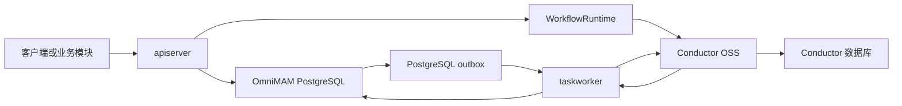
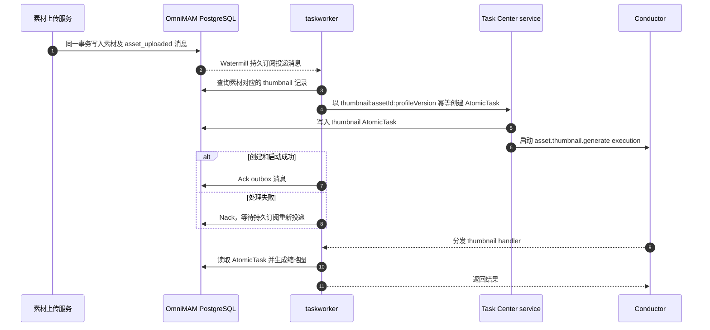

# TaskWorker 与 API Server 协作流程

本文说明 OmniMAM 中 `apiserver`、`taskworker`、Conductor 和 PostgreSQL 的职责边界，以及 AtomicTask 从创建到状态投影的完整流程。本文描述的是 Task Center `spec-v1.0.0` 对应的当前实现，不使用已废弃的 TaskRun、ExecutionLease 或自研 Dispatcher 协议。

## 1. 架构定位

Task Center 是对外业务入口和业务状态投影事实源，Conductor 是内部执行与编排运行时。`apiserver` 和 `taskworker` 不直接通过进程内调用协作，而是分别连接 OmniMAM 业务 PostgreSQL 和 Conductor：

该边界保证 API Server 保持无状态。扩容或重启 API Server 不会隐式创建新的进程内任务执行器；任务执行、自动重试、超时和运行历史由 Conductor 持久化管理。

## 2. 组件职责

| 组件 | 主要职责 | 不负责 |
| --- | --- | --- |
| `apiserver` | 提供 Task Center API；执行权限、租户、参数和 `functionRef` 校验；持久化 AtomicTask、Group、DAG 和 Schedule；通过 `WorkflowRuntime` 注册定义、启动、查询或取消执行 | 不注册 Worker handler，不执行后台任务，不维护 Worker lease |
| `taskworker` | 向 Conductor 注册受控 `functionRef` handler；读取 AtomicTask 业务快照并调用 executor；消费素材 outbox；运行 Task Center reconciler | 不提供外部业务 API，不实现队列、自动重试或 DAG 状态机 |
| Conductor | 负责任务调度、Worker 分发、并发控制、自动重试、超时、DAG 状态机和内部运行历史 | 不拥有 Task Center 业务资源，不直接写 OmniMAM 业务表 |
| OmniMAM PostgreSQL | 保存 Task Center 业务资源和状态投影、Application/Asset 等领域数据及 PostgreSQL outbox | 不保存 Conductor 的内部运行历史 |
| Conductor 数据库 | 保存 Conductor workflow、task、schedule 和重试历史 | 不作为前端或其他业务领域的查询入口 |

业务代码只依赖 `WorkflowRuntime` 接口。生产环境使用 `ConductorRuntime`，测试可以注入 fake；Controller、Service 和其他领域不得直接依赖 Conductor API 或数据库。

## 3. 启动协作

### 3.1 API Server 启动

`apiserver` 初始化业务数据库、Task Center service 和 `WorkflowRuntime`，然后启动 HTTP Server。它持有运行时控制能力，用于创建、查询、取消和管理任务，但不调用 `RegisterHandler`，也不启动任务执行 goroutine。

### 3.2 TaskWorker 启动

`taskworker` 使用与 API Server 一致的业务数据库配置，并连接同一个 Conductor。启动过程依次完成：

1. 初始化 OmniMAM store 和业务 schema。
2. 创建 `ConductorRuntime`。
3. 加载 application runtime registry 和 provider capability registry。
4. 构造 application、thumbnail、Engine 健康和 ComfyUI object-info executor。
5. 按受控 `functionRef` 向 Conductor 注册 AtomicTask handler 及并发度。
6. 订阅 `asset_uploaded` PostgreSQL outbox。
7. 幂等确保 Engine 健康检查与 ComfyUI object-info 刷新 SYSTEM RECONCILE Schedule。
8. 启动 reconciler，周期对账非终态 execution。

当前注册的 handler 包括：

- `application-platform.run`
- `asset.thumbnail.generate`
- `task_center_reconcile_controller`
- `task.schedule.acquire`

Engine 健康和 ComfyUI object-info 刷新不注册逐实例 Worker handler。两者分别以 `application-platform.engine-health` 和 `application-platform.comfyui-object-info-refresh` 注册到 `ReconcileRegistry`，由固定 `task_center_reconcile_controller` 直接扫描并更新业务事实。object-info 计划默认每日 `03:00 UTC` 运行，只处理 enabled、online 的 ComfyUI 实例；成功原子替换一对一当前目录，失败保留最后一次成功内容。

`taskworker` 收到 `SIGINT` 或 `SIGTERM` 后取消进程上下文，停止 outbox 消费和 reconciler，并关闭 Conductor Worker runner。

## 4. AtomicTask 主流程

流程中的关键边界如下：

- AtomicTask 是唯一由 Worker handler 执行的业务资源。TaskGroup、DAGTaskGroup 和 TaskSchedule 只负责编排或触发，不作为 Worker 业务执行单元。
- API Server 使用稳定的 correlation ID 和幂等键启动运行时，避免相同创建请求生成重复 execution。
- Worker 根据 Conductor 输入中的 `atomic_task_id` 从业务数据库加载完整业务快照，而不是信任用户传入任意 Worker 名、endpoint、脚本或凭证。
- Conductor 保存运行事实；Task Center 保存其他领域和前端可见的业务投影。外部调用方只通过 API Server 查询 Task Center。
- 自动重试由 Conductor 执行，并在同一个 AtomicTask 下投影新的 TaskAttempt；手动重试通过 API Server 创建新的 AtomicTask。

## 5. 素材上传与缩略图 outbox 流程

素材上传和缩略图生成通过 PostgreSQL outbox 解耦，避免素材记录已提交但缩略图任务通知丢失。

消费者组固定为 `task-center-thumbnail`。AtomicTask 使用素材 ID 和 profile version 组成幂等键，因此消息重投不会重复创建同一版本的缩略图任务。

## 6. 状态投影与故障恢复

当前实现由 `taskworker` 内的 reconciler 周期执行以下操作：

1. 从业务数据库批量读取非终态 AtomicTask。
2. 根据 `runtime_execution_id` 查询 Conductor execution。
3. 将 Conductor task 和 retry 历史转换为 TaskAttempt。
4. 更新 AtomicTask 状态、时间、输出、错误、当前 Attempt 和进度。
5. 写入具有稳定 `runtime_event_id` 的 RuntimeProjectionEvent，并通过 store 幂等应用投影。

各组件重启时遵循以下恢复规则：

| 故障或重启 | 恢复行为 |
| --- | --- |
| API Server 重启 | 已启动 execution 继续由 Conductor 管理；API Server 恢复后从业务 PostgreSQL 查询状态，不依赖旧进程内存 |
| TaskWorker 重启 | Conductor 保留待执行和运行历史；Worker 重新注册 handler 后继续领取任务，reconciler 重新扫描非终态任务 |
| Conductor 重启 | Conductor 从自身数据库恢复 workflow 和 task 历史；API Server 与 Worker 不切换到本地 Dispatcher |
| OmniMAM PostgreSQL 重启 | API 和 Worker 等待数据库恢复；业务资源与 outbox 由数据库持久化，不依赖进程内队列 |
| outbox 消费中断 | 未 Ack 的消息由 Watermill PostgreSQL subscriber 重新投递；AtomicTask 幂等键防止重复创建 |
| 投影遗漏或短暂失败 | reconciler 再次查询 Conductor，并幂等修复非终态 AtomicTask 和 TaskAttempt 投影 |

外部异步 executor 必须保存并优先使用 `external_job_id` 恢复外部作业，不能因为 Worker 或 API Server 重启而重复提交。

## 7. 强制约束

- API Server 必须保持 stateless，不得恢复进程内 Dispatcher 或以 goroutine 作为运行时不可用时的降级执行路径。
- Worker handler 只能执行 AtomicTask，不得直接执行 TaskGroup、DAGTaskGroup 或 TaskSchedule。
- 不得新增或恢复 TaskRun、TaskDefinition、ExecutionLease、Worker claim/heartbeat、watchdog 或自研 DAG 状态机。
- 用户和其他业务领域不得直接调用 Conductor API、读取 Conductor 数据库或使用 Conductor UI 代替 Task Center。
- 用户输入只能选择已注册的 `functionRef`，不得提交任意 HTTP、INLINE、脚本、Worker 名、凭证或内部运行时配置。
- Conductor 与 OmniMAM 业务表必须使用独立数据库或 schema，双方不得直接改写对方拥有的数据。
- 运行时不可用时保留可恢复业务状态，不得双写旧 TaskRun 或回退到旧任务协议。

## 8. 事实源与实现索引

产品语义和实现契约以 SSOT 为准：

- [Task Center 产品规格](../../../../ssot/00_product/domains/task-center/product-spec.md)
- [Task Center 模块契约](../../../../ssot/01_contracts/domains/task-center/module-contract.md)
- [Task Center 架构参考](../../../../ssot/02_architecture/domains/task-center.md)
- [后端实现规则](../../../../backend/AGENTS.md)

当前实现的关键入口：

- [`taskworker` 启动与 handler 注册](../../../../backend/internal/apiserver/taskworker.go)
- [Task Center service 与运行时启动](../../../../backend/internal/apiserver/service/v1/taskcenter/task_center.go)
- [Conductor `WorkflowRuntime` 适配](../../../../backend/internal/apiserver/workflowruntime/conductor.go)
- [运行时状态 reconciler](../../../../backend/internal/apiserver/service/v1/taskcenter/reconciler.go)
- [PostgreSQL outbox](../../../../backend/internal/apiserver/store/postgresql/outbox.go)
- [本地部署拓扑](../../../../deployments/docker-compose.yaml)

若实现与本文不一致，先根据已 release 的 SSOT 判断是实现偏差还是文档过期；不得直接修改 `ssot/` 子模块来适配 server 实现。
